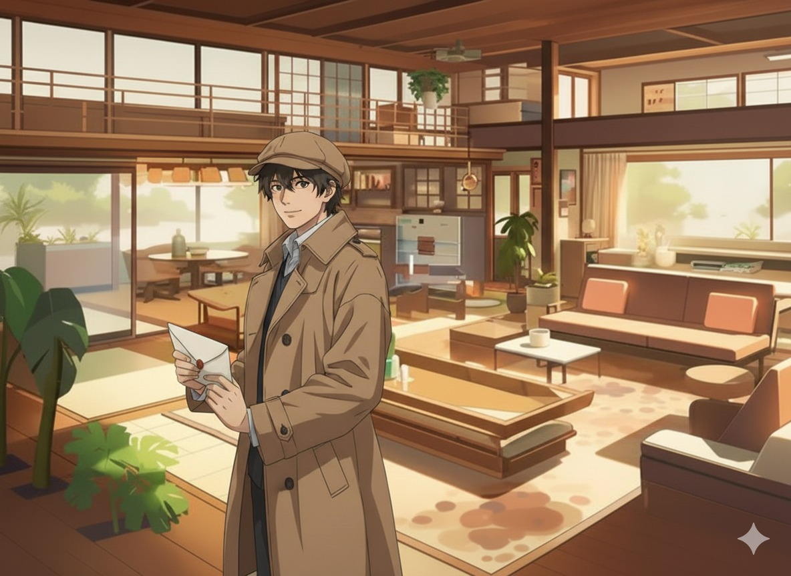
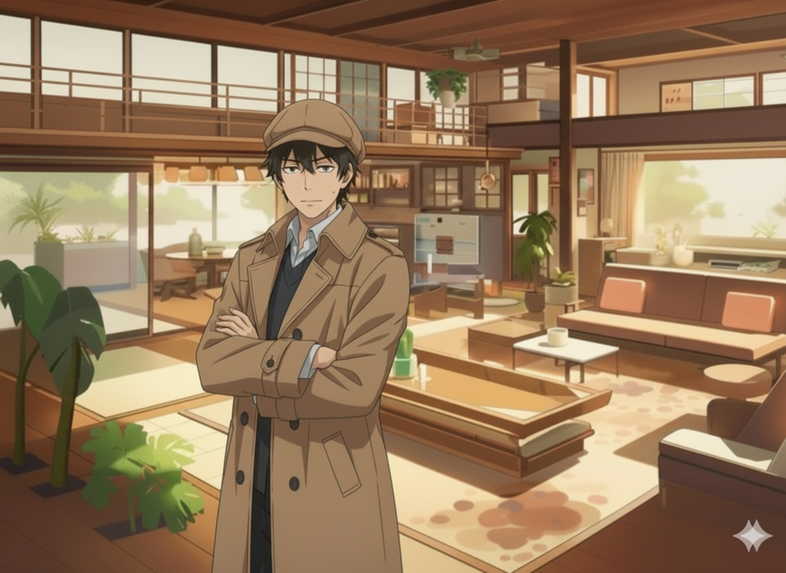
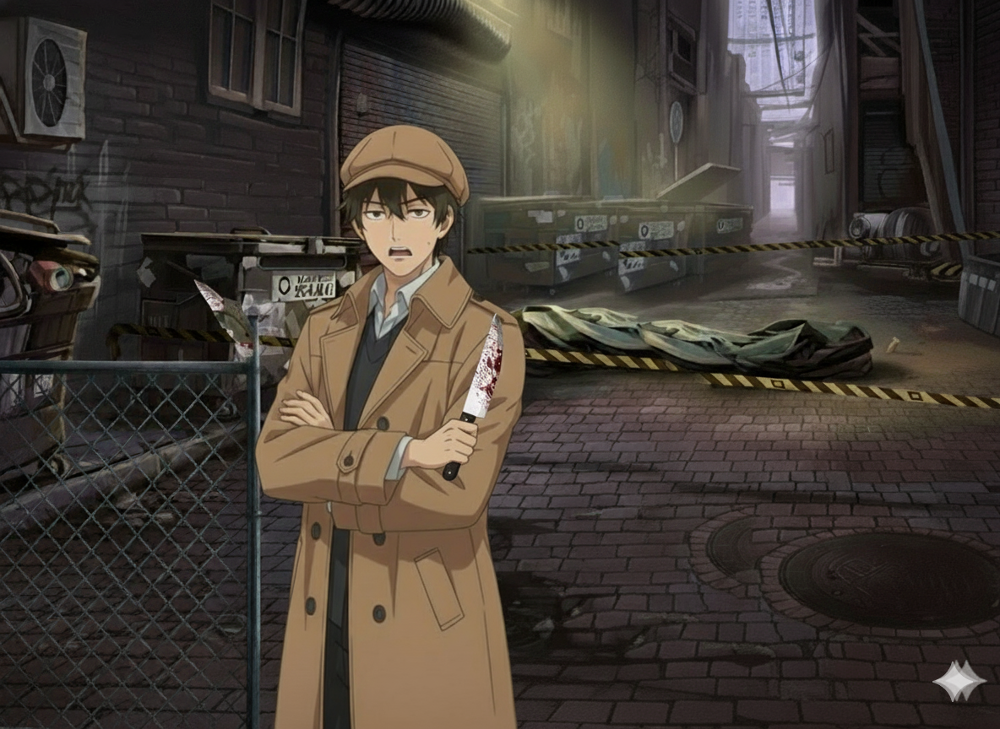
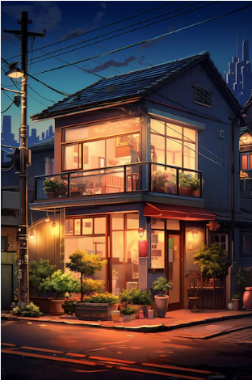

<h1 align="center">🧠 <b>O Julgamento da Mente</b></h1>

  <i>Um jogo narrativo interativo desenvolvido em Flutter, 
  onde suas escolhas — e suas habilidades — moldam o destino da sua mente.</i>

---

## 🎯 <b>PROPÓSITO DO PROJETO</b>

O projeto <b>“O Julgamento da Mente”</b> tem como principal objetivo aprofundar o conhecimento sobre o framework <b>Flutter</b>, explorando suas possibilidades de interface, navegação, animações e interatividade.  
Além do aprimoramento técnico, o jogo busca proporcionar uma experiência envolvente e reflexiva, utilizando elementos de mistério, julgamento moral e desafios mentais para criar uma narrativa imersiva.

---

## 🎮 <b>OBJETIVOS DO JOGO</b>

<b>“O Julgamento da Mente”</b> coloca o jogador em uma jornada psicológica onde cada decisão impacta diretamente o rumo da história.  
O jogador deverá investigar pistas, tomar decisões morais, interagir com personagens e desvendar fragmentos de sua memória até descobrir a verdade por trás do crime do qual é acusado.  
A cada escolha — ou a cada erro em um desafio — o jogador se aproxima de um dos possíveis finais: a Inocência, a Culpa ou a Insanidade.

---

## 🧩 <b>REQUISITOS DO JOGO</b>

### ⚙️ R1 — Interação, Tomada de Decisão e Minijogos

O sistema deverá permitir que o jogador avance na história por meio de escolhas interativas.  
Entretanto, diferentemente de um jogo narrativo tradicional, algumas escolhas só podem ser selecionadas após o jogador completar um <b>minijogo</b>, adicionando um elemento de habilidade e atenção ao processo decisório.

#### 🎯 R1.1 — Botões e Minijogos de Escolha

Antes de selecionar determinadas opções, o jogador deverá completar minidesafios, como puzzles simples, desafios de agilidade ou lógica rápida.  
Esses minijogos tornam as decisões mais dinâmicas e simbolizam o esforço mental do personagem para “organizar” seus pensamentos e memórias.  
Após vencer o desafio, o botão correspondente à decisão é desbloqueado.

#### 🧾 R1.2 — Registro das Escolhas

Cada escolha tomada — ou cada minijogo falhado — influenciará diretamente os próximos eventos da narrativa, alterando diálogos, pistas disponíveis e até o final obtido pelo jogador.

---

### 📖 R2 — Exibição da História e Diálogos

O sistema apresenta a narrativa de forma estilizada, com textos legíveis e alinhados ao clima misterioso do jogo.  
Elementos como falas, pensamentos e descrições possuem destaque visual compatível com a atmosfera psicológica da obra.

#### 📝 R2.1 — Formatação dos Textos

Os textos aparecem centralizados ou com espaçamento adequado conforme o contexto da cena, garantindo clareza e imersão na leitura.

---

### 🔚 R3 — Múltiplos Finais

As escolhas e o desempenho nos minijogos levarão o jogador a diferentes finais possíveis.

#### ⚖️ R3.1 — Final “Inocência”

Obtido quando o jogador desvenda todas as pistas corretamente e identifica o verdadeiro culpado.

#### 🚫 R3.2 — Final “Acusado Injustamente”

Ocorre quando o jogador reúne informações insuficientes ou escolhe o suspeito errado.

#### 🌀 R3.3 — Final “Insanidade”

Alcançado quando o jogador toma decisões incoerentes, falha em minijogos importantes ou demonstra incapacidade de reconstruir a própria memória.

---

## 👥 <b>INTEGRANTES DO GRUPO</b>

<table align="center">
  <tr><th>Função</th><th>Nome</th></tr>
  <tr><td>GD</td><td>Larissa Moroni Breda</td></tr>
  <tr><td>GD</td><td>Leticia Venturin Voltarelli</td></tr>
  <tr><td>ADI</td><td>Gabriel Giorgetti Faria</td></tr>
  <tr><td>ADI</td><td>Ana Clara Wutzler</td></tr>
  <tr><td>GDR</td><td>David Manoel Aquino de Oliveira</td></tr>
  <tr><td>GDR</td><td>Mirella Oliveira</td></tr>
</table>

---

## 🖼️ <b>IMAGENS DO PROJETO</b>

  <i>Imagens usadas para cenas e ambientes de <b>O Julgamento da Mente</b>.</i>

<table align="center">
  <tr><th>Cena</th><th>Imagem</th></tr>
  <tr><td>Adrian 1</td><td></td></tr>
  <tr><td>Adrian 2</td><td></td></tr>
  <tr><td>Adrian 3</td><td></td></tr>
  <tr><td>Adrian 4</td><td></td></tr>
  <tr><td>Adrian 5</td><td></td></tr>
  <tr><td>Adrian com faca</td><td></td></tr>
  <tr><td>Beco</td><td></td></tr>
  <tr><td>Beco 2</td><td></td></tr>
  <tr><td>Cadeia</td><td></td></tr>
  <tr><td>Casa do Adrian</td><td></td></tr>
  <tr><td>Cena do crime</td><td></td></tr>
  <tr><td>Digital</td><td></td></tr>
  <tr><td>Faca escondida</td><td></td></tr>
  <tr><td>Final 1</td><td></td></tr>
  <tr><td>Final 2</td><td></td></tr>
  <tr><td>Final 3</td><td></td></tr>
  <tr><td>Fundo</td><td></td></tr>
  <tr><td>Imagem extra</td><td></td></tr>
  <tr><td>Mendigo 1</td><td></td></tr>
  <tr><td>Mendigo 2</td><td></td></tr>
  <tr><td>Prisão</td><td></td></tr>
  <tr><td>Tribunal</td><td></td></tr>
</table>

---

  <i>© 2025 — Projeto acadêmico desenvolvido com Flutter. 
  Todos os direitos reservados aos integrantes do grupo.</i>

